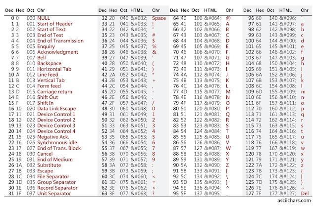

# A-Better-Caesar-Cipher
# Lab-10

## Objectives

At the completion of this lab you should be able to:
+	Describe how the scanner class is used to read integer data from a single line.
+	Explain why it is necessary and how to handle the newlines that are left in the input buffer when using Scanner.
+	Explain how a shifted key Caesar Cipher works.
+	Use the java.util.ArrayDeque class to implement a shifted key Caesar Cipher. 

## Background

A Caesar cipher is a simple and well known encrpytion technique named after Julius Caesar, who used it in personal
correspondence. It is a form of substitution cipher where each letter
in the original message is replaced by a letter some fixed number of positions down the alphabet. For example, with a
right shift of 2, the messsage "Hello World" becomes "Jgnnq Yqtnf". Decoding the message involves shifting back down
the alphabet the same number of spaces. The encoding "wraps" so that 'A' immediately follows 'Z' (and 'Z' precedes
'A'). The choice of shifting left or right (up or down) the alphabet is not important as long as it is applied
consistently.

Single key Caesar ciphers are easily broken. One method that adds a small amount of additional security is to shift the
alphabet a different amount for each letter using a sequence of keys. For example, I might shift the first letter
2 spaces to the right, the second letter 9 spaces, and so on. If the sequence of keys I use is shorter than the message
I simply return to the beginning of the sequence and begin again.

## The algorithm

We will implement a Caesar cipher application using a sequence of integer keys. The appplication first asks
the user for a list of integers to use as keys. The main loop guides the user through encoding or decoding
messages until they choose not to continue. This code is provided for you in the CipherApp class.

You are to finish implementing the four methods in the CaesarCipherEngine class. The class uses the ArrayDeque `keyQ`
to store the key values. When encoding/decoding a message you will use the value from the front of the queue to
encode/decode a letter and then place the key at the end of the queue. The queue is initialized from the integer array
`keys`. It must be reinitialized before every encode and decode to ensure that the key values align.

Shifting is accomplished by converting characters to integers and adding or subtracting. Fortunately, Java characters
are encoded as integers. All you need to do to obtain the ASCII value is to cast the value as an `int`. For example:

```java
char letter = 'a';
int ascii = (int) letter;
```

Remember that Java uses single quotes to delimit characters and double quotes for strings. You will use the modulo
operator (%) to wrap the alphabet. *Note: Control characters (ASCII values below 32 or above 126) should not be
encoded. You will need to write code to ensure these characters are excluded from your ciphertext. Any control
characters included in user input should be replaced with the `space` character (ASCII 32)*. You will need to
write the arithmetic and/or logic expressions to handle these cases. (Hint: a similar shift is required when
converting temperature values between Fahrenheit and Celsius.)

The ASCII values for characters are given in the following chart.



## Exploring the code
**Edit this file to answer the questions below** 

1. Where did you find the executable class? In other words, which package and class contains the main function?
Why is the package named ui?  
   
The executable class is in the ui package, and it's called cipherapp. The class is contained in the ui package because the app is an interface that the user interacts with to see the cypher.


2.	Read the code in the CipherApp class.

    a. What code do you have to write?

    The encode, decode, constructor, and initializeKey methods. 

    b. Read the code for the readKeys method and explain why the in.nextLine() method is called on line 114.  
    *Hint: Comment out the line and run the code to see what happens.*

    It clears the new line from the input. The program throws an exception since it can't recognize 0 as being the end.
3. Read the Java API page for ArrayList. Why in the readKeys method is an ArrayList used to read the list of numbers
before transferring them to an array?


    Because we can create a new list of keys by adding a new key to the end.

## Completing the CaesarCipher Code

The methods for the CaesarCipherEngine class are each stubbed.   Complete the code for each method based upon the
internal documentation for each method.  The code requires the use of the java.util.ArrayDeque class.
You will find it helpful to read the Java API page for the ArrayDeque class before you start coding the methods.
My suggestion is to implement the methods in the following order: 1) initializeKeyQ, 2) the constuructor,
3) the encode method, and 4) the decode method.

## Finishing Up
When you are finished push your code back to your remote repo for Lab 10.

## Grading Rubric
1.  Answered all questions in the README.  (8 points)
    (1 point for each answer.)
    1.  The ui package contains the user interface for the program.
    2.  The encode, decode, constructor, and initializeKeys methods need to be written.
    3.  in.nextLine() clears the new line from the input buffer.
    4.  It allows us to build the list of keys by simply adding a key to the end of the list.
2.  The program runs correctly.  (8 points) Use the three keys 1 2 3 for the following:
    1.  2 points - the program encodes the sentence, "The quick brown fox", correctly.
    2.  1 point - the program encodes a~b as b!e.
    3.  1 point - the program decodes b!e as a~e.
3.  The program constructor creates the array, and the deque objects and copies the list of keys into the instance variable keys. (4 points) 


